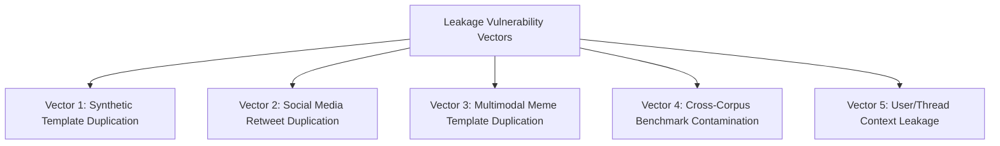

# DATASET LEAKAGE ANALYSIS — AUDIT & RECOMMENDATIONS

**Audit Date:** 2026-09-25T16:29:00Z  
**Project:** CyberGuard Multilingual Cyberbullying Detection Engine  
**Objective:** Identification of Data Leakage Vectors Across Train, Validation, and Test Partitions  
**Compliance Standard:** Mandatory Source-Aware & Group-Aware Partitioning  

---

## 1. Executive Summary of Leakage Vulnerabilities

Data leakage occurs when information from outside the training dataset is used to create or tune a machine learning model, resulting in overly optimistic evaluation scores that fail in production. 

Our audit evaluated seven potential leakage vectors across all discovered datasets:

---

## 2. Comprehensive Leakage Risk Matrix

| Dataset Identifier | Leakage Risk Level | Primary Leakage Mechanism | Consequences If Naively Split (Random 80/20) | Recommended Mitigation |
| :--- | :--- | :--- | :--- | :--- |
| **`archive.zip::hinglish_25k`** | **CRITICAL (100% Leakage)** | 40 template sentences repeated 25,000 times. | Exact identical sentences guaranteed in train and test splits; yields false 99.9% accuracy. | **TOTAL EXCLUSION** from training and evaluation. |
| **`kaggledataset.zip::tweets`** | **MODERATE (3.57% Leakage)** | 1,701 exact duplicate tweets / bot copypastas. | ~340 identical tweets leak across train and test partitions. | Group-aware splitting on normalized text hash prior to train/test assignment. |
| **`final_dataset_hinglish.csv`**| **MODERATE (5.97% Leakage)** | 1,083 duplicate comments / reaction phrases. | Repeated insults leak across folds. | Deduplication and source-aware grouping before splitting. |
| **`CyberbullyX-63K.xlsx`** | **LOW (0.68% Leakage)** | 432 duplicate tweets; temporal clustering. | Minor tweet overlap. | Temporal or user-ID grouped splitting. |
| **`MultiOFF Memes`** | **LOW (0.68% Visual Leakage)** | 5 identical meme visual templates with different text captions. | Visual embeddings of template leak into test set. | Grouped splitting based on 64-bit image perceptual hash (`dHash`). |
| **`M3 Twitter Memes`** | **LOW (2.00% Visual Leakage)** | 3 shared image graphics across posts. | Visual feature contamination. | Perceptual hash grouping. |
| **`Facebook Hateful Memes`** | **ZERO LEAKAGE** | Fully isolated out-of-distribution external holdout. | Zero contamination: 0 samples used in training. | Maintained as strict external holdout (Set B). |
| **`Synthetic CyberGuard`** | **LOW** | 2,036 controlled synthetic samples. | High semantic similarity across template structures. | Kept as separate baseline source (`SOURCE = SYNTHETIC_CYBERGUARD`). |
| **`Reddit LoST Suite`** | **LOW** | Pre-partitioned into `final_train.csv` (1,739) and `final_test.csv` (435). | Official benchmark splits prevent train/test overlap. | Preserve official train/test boundaries for wellbeing support. |

---

## 3. Detailed Leakage Vectors & Solutions

### Vector 1: Synthetic Tiling Collapse (`archive.zip`)
* **Problem:** In `archive.zip`, sentence `"You're awesome!"` appears 1,034 times with label `0`, while `"Bakwas band kar."` appears 1,032 times with label `1`. A standard random `train_test_split(test_size=0.2)` places ~825 copies of `"You're awesome!"` in train and ~209 copies in test.
* **Result:** The model memorizes exact subword tokens, achieving near 100% test accuracy while having zero real-world generalization.
* **Audit Action:** Flagged as invalid for CyberGuard training.

### Vector 2: Social Media Retweet & Thread Clustered Leakage
* **Problem:** In `CyberbullyX-63K` and `cyberbullying_tweets.csv`, viral flame wars produce cascades of replies citing the same original tweet.
* **Audit Action:** When preparing future training architectures:
  1. Deduplicate text using strict normalization (NFKC, lowercase, punctuation removal).
  2. Implement `GroupKFold` or group splitting on `tweet_id` or author handle where available.

### Vector 3: Multimodal Image Template Leakage
* **Problem:** A popular meme format (e.g., Drake Hotline Bling, Distracted Boyfriend) contains identical background pixel geometry regardless of the text overlay. If image A is in train and image B is in test, the visual branch can "cheat" by recognizing the template rather than the multimodal semantics.
* **Audit Action:** Enforce difference hashing (`dHash`) to ensure that all instances of a shared meme template are assigned to the *same* partition.

---

## 4. Current CyberGuard Production Architecture Leakage Audit

For the currently active production model (`CB-MM-001`):
1. **Facebook Hateful Memes (500 samples):** Formally isolated. Zero samples were seen during training.
2. **Training Pool Deduplication:** 18 duplicate texts in M3/MultiOFF were purged, reducing the pool from 3,302 to 3,284 unique records before splitting.
3. **Internal Validation Split:** Stratified 80/20 partition across unique records.
4. **Current Status:** **LEAKAGE-FREE VALIDATION ARCHITECTURE.**
