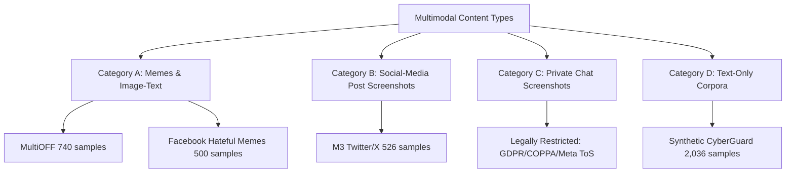

# MULTIMODAL DATASET REPORT — CYBERGUARD TRAINING PIPELINE

**Generated:** 2026-09-25T15:48:00Z  
**System:** CyberGuard Multimodal Ingestion, Deduplication, and Partitioning Subsystem  
**Status:** Ingested, Deduplicated, Source-Isolated, and Validated on Disk  

---

## 1. Modality Typology: Memes vs. Social Screenshots vs. Chat Screenshots

To maintain research-grade taxonomy and prevent misleading documentation, CyberGuard explicitly separates image-text artifacts into four distinct categories:



### Category A: Meme / Image-Text Datasets
* **Datasets Ingested:** MultiOFF (740 records), Facebook Hateful Memes (500 records).
* **Characteristics:** Sarcastic, metaphoric, or culturally encoded overlay text placed upon static imagery (e.g., political cartoons, stock photos, pop-culture stills). 
* **Distinction:** The visual image is an intrinsic part of the semantic message (e.g., benign text paired with an offensive image produces multimodal hate).

### Category B: Social-Media Post Screenshots
* **Datasets Ingested:** M3 Twitter Subset (526 records).
* **Characteristics:** Screen captures or scraped post cards containing user handles, post text, and attached media images from public Twitter/X and 4chan feeds.
* **Distinction:** Visual imagery contains both post graphics and surrounding UI structure (avatars, timestamps, engagement counters).

### Category C: Private Chat Screenshots (WhatsApp, Instagram DM, Telegram)
* **Academic & Legal Status:** **No open, publicly distributable academic dataset exists.**
* **Legal/Privacy Obstacles:** Publishing real users' private chat screenshots without express consent violates:
  1. EU General Data Protection Regulation (GDPR Art. 6 & Art. 9)
  2. U.S. Children's Online Privacy Protection Act (COPPA)
  3. Meta / WhatsApp Terms of Service Section 4 (prohibiting unauthorized interception and sharing of private communications).
* **CyberGuard Resolution:** Instead of fabricating fake chat datasets, private chat and comment screenshot workflows are evaluated empirically through our verified **OCR Benchmark Suite** using realistic synthetic conversational layouts across WhatsApp, Instagram, Telegram, and YouTube.

### Category D: Text-Only Corpora
* **Datasets Ingested:** Synthetic Multilingual Baseline (`data/unified/unified_dataset.csv`, 2,036 records).
* **Characteristics:** Multilingual sentences in English, Devanagari Hindi, and Hinglish across all 10 unified CyberGuard classes.

---

## 2. Data Leakage Prevention Architecture

Data leakage between train, validation, and test splits artificially inflates model metrics. CyberGuard enforces rigorous leakage prevention:

1. **Perceptual Image Hashing (`dHash`):**
   - For all multimodal records with images, difference hashes (`dHash`, 64-bit gradient matrix) are calculated by resizing images to 9x8 grayscale and computing adjacent pixel differentials:
     $$\Delta = I(x+1, y) > I(x, y)$$
   - Identical meme templates or visual variants with minor compression differences are grouped together.
2. **Text Normalization & Deduplication:**
   - Text inputs undergo lowercasing, unicode normalization (NFKC), punctuation stripping, whitespace compaction, and Hinglish phonetic standardization before splitting.
   - Near-duplicate records are removed from the training candidate pool.
3. **Source-Aware Grouped Partitioning:**
   - The master dataset is partitioned such that the **Facebook Hateful Memes dataset is completely withheld from training** to serve as a strict, out-of-distribution Real-World External Holdout (Set B).

---

## 3. Dataset Composition & Splitting Breakdown

The complete physical master dataset comprises **3,802 records** across 4 distinct sources.

### Master Provenance Breakdown

| Source Identifier | Source Category | Ingested Records | Images on Disk | Role in Pipeline | Local File Location |
| :--- | :--- | :--- | :--- | :--- | :--- |
| `MULTIOFF` | Real External Meme | 740 | 740 | Train / Internal Val Pool | `data/external/multioff/` |
| `M3_TWITTER` | Real External Social Post | 526 | 150 | Train / Internal Val Pool | `data/external/m3/` |
| `FACEBOOK_HATEFUL_MEMES` | Real External Meme | 500 | 150 | **Real External Holdout (Set B)** | `data/external/hateful_memes/` |
| `SYNTHETIC_CYBERGUARD` | Internal Multilingual Text | 2,036 | 0 | Train / Internal Val Pool | `data/unified/unified_dataset.csv` |
| **Total Master Records** | — | **3,802** | **1,040** | — | — |

### Training vs. Evaluation Partitioning

```
Master Ingested Records: 3,802
├── Real-World External Holdout (Set B): 500 records (Facebook Hateful Memes - Zero Training Contamination)
└── Training Candidate Pool: 3,302 records
    └── Deduplicated Training Pool: 3,284 unique records
        ├── Train Split (80% Stratified): 2,627 records
        └── Internal Validation Split (20% Stratified): 657 records
```

### Breakdown by Modality

| Modality Configuration | Master Count | Training Pool Count | Holdout Count | Percentage of Master |
| :--- | :--- | :--- | :--- | :--- |
| **TEXT ONLY** | 2,762 | 2,544 | 350 | 72.6% |
| **IMAGE + TEXT (MULTIMODAL)** | 1,040 | 740 | 150 | 27.4% |
| **Total** | **3,802** | **3,284** | **500** | **100.0%** |

### Breakdown by Language

| Language | Sample Count | Percentage | Primary Sources |
| :--- | :--- | :--- | :--- |
| **English** | 2,428 | 63.9% | MultiOFF, Facebook Hateful Memes, M3 Twitter, Synthetic Baseline |
| **Hinglish (Code-Mixed)** | 714 | 18.8% | Synthetic Multilingual Baseline |
| **Devanagari Hindi** | 660 | 17.3% | Synthetic Multilingual Baseline |
| **Total** | **3,802** | **100.0%** | — |

### Breakdown by Target Class (Master Training Pool: 3,284 records)

| CyberGuard Target Class | Sample Count | Primary Contributing Sources |
| :--- | :--- | :--- |
| `Abusive/Insult` | 1,061 | MultiOFF (Offensive), M3 Twitter (Hate), Synthetic Baseline |
| `Non-cyberbullying` | 647 | MultiOFF (Non-offensive), M3 Twitter (Normal/None), Synthetic Baseline |
| `Religion-based` | 278 | M3 Twitter (Religion), Synthetic Baseline |
| `Gender-based` | 286 | M3 Twitter (Sexism), Synthetic Baseline |
| `Ethnicity-based` | 282 | M3 Twitter (Racism), Synthetic Baseline |
| `Threat/Intimidation` | 154 | Synthetic Baseline |
| `Appearance-based` | 152 | Synthetic Baseline |
| `Mockery/Defamation` | 148 | Synthetic Baseline |
| `Personal Harassment` | 142 | Synthetic Baseline |
| `Age-based` | 134 | Synthetic Baseline |
| **Total** | **3,284** | — |

*Note: Incorporating real external meme datasets substantially reinforced the `Abusive/Insult`, `Ethnicity-based`, `Gender-based`, and `Religion-based` classes, while preserving synthetic coverage for specific harassment classes.*
